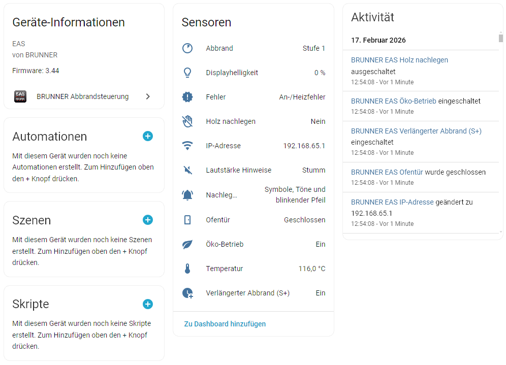

# BRUNNER Combustion Control for Home Assistant

[![hacs][hacs-shield]][hacs]
[![GitHub Release][releases-shield]][releases]
[![License][license-shield]](LICENSE)
[![HACS Workflow Status][hacs-validation-shield]][hacs-validation]
[![Hassfest Workflow Status][hassfest-validation-shield]][hassfest-validation]

This custom integration adds support for BRUNNER combustion control ([Elektronische Abbrandsteuerung EAS 3][brunner-eas]) to Home Assistant.

Sensors available:

- Temperature
- Combustion phase
- Door status
- Eco mode
- S+ mode
- Reloading indications and notes
- Error states
- Display brightness
- Tone loudness
- IP address

Device information:

- Firmware version
- MAC address

Supported languages:

- English
- Deutsch

If you encounter any problems, please file an issue at the integration's [issue tracker](https://github.com/Manschitz/brunner-eas-integration/issues).

## Disclaimer

This integration is provided as-is, without any warranty, support, endorsement, or affiliation from [Ulrich Brunner GmbH](https://www.brunner.de/). I do not take responsibility for any problems it may cause in all cases. Use it at your own risk.

The work is based on the findings by [sharky-os](https://github.com/sharky-os) and [JR-Home](https://github.com/JR-Home) from this [ioBroker issue](https://github.com/ioBroker/AdapterRequests/issues/761).

## Screenshots

## Installation and Configuration

As this integration is currently not part of Home Assistant Core, you have to download it first into your Home Assistant installation. To download it via HACS, click the following button to open the download page for this integration in HACS.

After a restart of Home Assistant, this integration is configurable via "Add Integration" at "Devices & Services" like any core integration. Your EAS3 device should be detected automatically if it's on the same local network as your Home Assistant. You can also add the integration manually with this link:

[hacs]: https://github.com/hacs/integration
[hacs-shield]: https://img.shields.io/badge/HACS-Custom-41BDF5.svg?style=for-the-badge&logo=homeassistantcommunitystore
[license-shield]: https://img.shields.io/github/license/Manschitz/brunner-eas-integration?style=for-the-badge&color=blue&logo=agpl
[brunner-eas]: https://www.brunner.de/produkt/elektronische-abbrandsteuerung-eas-3/
[releases]: https://github.com/Manschitz/brunner-eas-integration/releases
[releases-shield]: https://img.shields.io/github/v/release/Manschitz/brunner-eas-integration?style=for-the-badge&logo=homeassistantcommunitystore
[hacs-validation]: https://github.com/Manschitz/brunner-eas-integration/actions/workflows/hacs.yml
[hacs-validation-shield]: https://img.shields.io/github/actions/workflow/status/Manschitz/brunner-eas-integration/hacs.yml?label=HACS&style=for-the-badge
[hassfest-validation]: https://github.com/Manschitz/brunner-eas-integration/actions/workflows/hassfest.yml
[hassfest-validation-shield]: https://img.shields.io/github/actions/workflow/status/Manschitz/brunner-eas-integration/hassfest.yml?label=Hassfest&style=for-the-badge